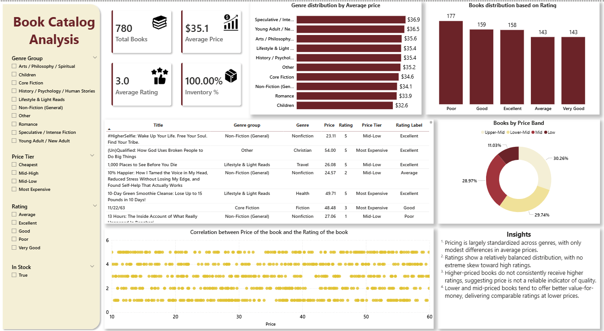

**#📚 Book Data Analysis:**

An end-to-end Data Analytics project that collects book data using web scraping, performs data cleaning and exploratory analysis using Python, and presents insights through an interactive Power BI dashboard.

**## Tools Used:**  Python, BeautifulSoup, Pandas, Jupyter Notebook, Power BI

**## Dataset Size:**  780 Books

**## Focus Areas:**  Pricing trends, rating distribution, genre analysis

**## Dashboard Preview:**

**## Project Overview:**

This project analyzes a catalog of books collected through web scraping. The goal is to explore patterns in book pricing, ratings, genres, and inventory availability. The project demonstrates an end-to-end data analytics workflow including data collection, cleaning, exploratory data analysis, and dashboard visualization.

**## Objective:**

The objective of this project is to analyze book catalog data and identify trends in pricing, ratings, and genre distribution. By processing raw scraped data and visualizing it through dashboards, the project aims to understand how book prices, ratings, and genres are distributed and whether pricing influences ratings.

**## Dataset:**

The dataset was created by scraping an online book catalog website and cleaned for analysis. Information collected includes: Book Title, Genre, Price, Rating, Inventory Availability

**## Project Workflow:**

1. Web Scraping : Collected book data including title, price, rating, and stock availability using Python.
2. Data Cleaning : Cleaned and structured the scraped data to prepare it for analysis.
3. Exploratory Data Analysis : Analyzed price ranges, rating distributions, and genre patterns.

**## Dashboard Development:**  Created a Power BI dashboard to visualize insights interactively.

**## Key Insights:**

1. The dataset contains 780 books with an average price of $35.1.
2. Book prices are relatively consistent across genres.
3. Ratings are balanced across categories such as Good, Very Good, and Excellent.
4. Higher priced books do not consistently receive higher ratings.
5. Mid-priced books often provide similar ratings to expensive books.

**## Skills Demonstrated:**  Web Scraping, Data Cleaning, Exploratory Data Analysis, Data Visualization, Dashboard Development, Data Storytelling
